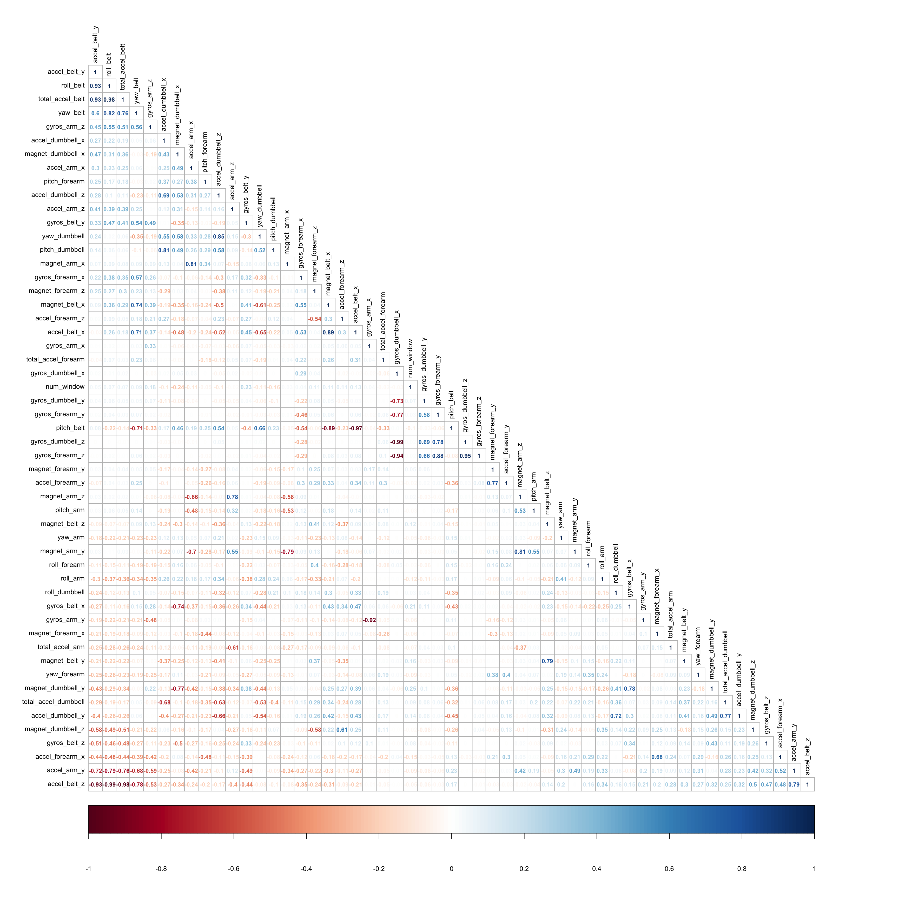

Practical Machine Learning \_ Assignment
================
Qian Wang
January 4, 2017

Introduction
------------

Using devices such as Jawbone Up, Nike FuelBand, and Fitbit it is now possible to collect a large amount of data about personal activity relatively inexpensively. These type of devices are part of the quantified self movement – a group of enthusiasts who take measurements about themselves regularly to improve their health, to find patterns in their behavior, or because they are tech geeks. One thing that people regularly do is quantify how much of a particular activity they do, but they rarely quantify how well they do it. In this project, your goal will be to use data from accelerometers on the belt, forearm, arm, and dumbell of 6 participants.

For more details, please visit: <http://groupware.les.inf.puc-rio.br/har>

The goal of your project is to predict the manner in which they did the exercise. This is the "classe" variable in the training set. You may use any of the other variables to predict with. You should create a report describing how you built your model, how you used cross validation, what you think the expected out of sample error is, and why you made the choices you did. You will also use your prediction model to predict 20 different test cases.

``` r
library(rpart)
library(knitr)
library(caret)
library(corrplot)
library(dplyr)
library(rpart.plot)
library(randomForest)
library(rattle)
set.seed(2017-01-06)
```

Download the files from the websites supplied:

Read and clean the datas:

``` r
# training is for the real train and test sets.
training <- read.table(file = "/Users/QianWang/Documents/Coursera_8_practicalMachineLearning/week4/training.csv", header = T, sep = ",")
# test is for the 20 quiz questions.
test <- read.table(file = "/Users/QianWang/Documents/Coursera_8_practicalMachineLearning/week4/test.csv", header = T, sep = ",")

# Some of the variables are flat without much variance, which is uselessful for correlation detection. So we are going to remove them.
flat <- nearZeroVar(training)
training <- training[,-flat]

# There are many variables containing NA, which is annoying for later modelling. We are going to remove the variables that are mostly NAs.
good <- sapply(training,function(x) mean(is.na(x))) <=0.95
training <- training[,good]

# some of the variables are labeles or identification of the observations. They have nothing to do with the correlation or modelling. We will pick them off the data set.
training <- training[,-c(1:5)]

# Now, the data is clean. We want to randomly split the data to trainSet and testSet.
inTrain<- createDataPartition(training$classe,p=0.7,list = F)
trainSet <- training[inTrain,]
testSet <- training[-inTrain,]
```

Explore the data (roughly check out the correlation among the variables, make sure there are no highly correlated variables to slow down the modelling algorithms):

``` r
# The correlation numbers will be shown in a more eligible way by recruiting corrplot function. The darker red and blue indicates the higher correlation.
corGraph <- cor(trainSet[, colnames(trainSet)!="classe"])
corrplot(corGraph, order = "FPC", method = "number", type = "lower", 
         tl.cex = 0.8, tl.col = rgb(0, 0, 0),number.cex = 0.7, number.digits = 2)
```



There are several variables that are highly correlated (&gt;0.90 or &lt; -0.90). In order to save the calculating source, we are going to remove some of the variables.

``` r
# The redundant variables have been detected according to the correlation number shown above. Those variables which share over 0.90 (or less than -0.90) correlation will be removed and left only one variable.
trainSet <- trainSet %>%
        select(-c(accel_belt_y,roll_belt,accel_belt_z,gyros_arm_y,pitch_belt,gyros_dumbbell_z,gyros_dumbbell_x,gyros_forearm_z))
testSet <- testSet %>%
        select(-c(accel_belt_y,roll_belt,accel_belt_z,gyros_arm_y,pitch_belt,gyros_dumbbell_z,gyros_dumbbell_x,gyros_forearm_z))
```

Modelling and prediction:
-------------------------

In order to obtain the best modelling, we are going to try three different methods (Generalized Boosted Model, Random Forest, Decison Tree) and pick up the one with most accurate prediction rate by predicting and comparing with the testSet "classe", using the three modelling respectively.

### This is first modelling with methods of "gbm":

``` r
# This is the 1st model by using the gbm methods.
set.seed(2017-01-04)
controlGBM <- trainControl(method = "repeatedcv", number = 5, repeats = 1)
mod_gbm <- train(classe ~ ., data=trainSet, method = "gbm",
                    trControl = controlGBM, verbose = FALSE)
mod_gbm$finalModel
```

    ## A gradient boosted model with multinomial loss function.
    ## 150 iterations were performed.
    ## There were 45 predictors of which 39 had non-zero influence.

``` r
# Predict the results by using the testSet. And calculate the accuracy by comparing with the testSet "classe".
pred_gbm <- predict(mod_gbm, newdata=testSet)
conf_gbm <- confusionMatrix(pred_gbm, testSet$classe)
conf_gbm
```

    ## Confusion Matrix and Statistics
    ## 
    ##           Reference
    ## Prediction    A    B    C    D    E
    ##          A 1672   11    0    0    0
    ##          B    2 1119   14    4    1
    ##          C    0    8 1011   12    2
    ##          D    0    0    1  947   10
    ##          E    0    1    0    1 1069
    ## 
    ## Overall Statistics
    ##                                           
    ##                Accuracy : 0.9886          
    ##                  95% CI : (0.9856, 0.9912)
    ##     No Information Rate : 0.2845          
    ##     P-Value [Acc > NIR] : < 2.2e-16       
    ##                                           
    ##                   Kappa : 0.9856          
    ##  Mcnemar's Test P-Value : NA              
    ## 
    ## Statistics by Class:
    ## 
    ##                      Class: A Class: B Class: C Class: D Class: E
    ## Sensitivity            0.9988   0.9824   0.9854   0.9824   0.9880
    ## Specificity            0.9974   0.9956   0.9955   0.9978   0.9996
    ## Pos Pred Value         0.9935   0.9816   0.9787   0.9885   0.9981
    ## Neg Pred Value         0.9995   0.9958   0.9969   0.9965   0.9973
    ## Prevalence             0.2845   0.1935   0.1743   0.1638   0.1839
    ## Detection Rate         0.2841   0.1901   0.1718   0.1609   0.1816
    ## Detection Prevalence   0.2860   0.1937   0.1755   0.1628   0.1820
    ## Balanced Accuracy      0.9981   0.9890   0.9904   0.9901   0.9938

``` r
# Plot the prediction restuls.
plot(conf_gbm$table, col = conf_gbm$byClass, 
     main = paste("Accuracy of gbm is ", round(conf_gbm$overall['Accuracy'], 4)))
```


### This is the second modelling with the methods of "rf":

``` r
# This is the modelling with the methods of random forest:
set.seed(2017-01-04)
controlRF <- trainControl(method="cv", number=3, verboseIter=FALSE)
mod_rf <- train(classe ~ ., data=trainSet, method="rf",
                          trControl=controlRF)
mod_rf$finalModel
```

    ## 
    ## Call:
    ##  randomForest(x = x, y = y, mtry = param$mtry) 
    ##                Type of random forest: classification
    ##                      Number of trees: 500
    ## No. of variables tried at each split: 23
    ## 
    ##         OOB estimate of  error rate: 0.25%
    ## Confusion matrix:
    ##      A    B    C    D    E  class.error
    ## A 3904    1    0    0    1 0.0005120328
    ## B    5 2647    6    0    0 0.0041384500
    ## C    0   12 2384    0    0 0.0050083472
    ## D    0    0    7 2245    0 0.0031083481
    ## E    0    0    0    3 2522 0.0011881188

``` r
# Predict the results with the testSet and compare with the testSet "classe"
pred_rf <- predict(mod_rf, newdata=testSet)
conf_rf <- confusionMatrix(pred_rf, testSet$classe)
conf_rf
```

    ## Confusion Matrix and Statistics
    ## 
    ##           Reference
    ## Prediction    A    B    C    D    E
    ##          A 1674    5    0    0    0
    ##          B    0 1128    0    0    0
    ##          C    0    6 1026   10    0
    ##          D    0    0    0  953    2
    ##          E    0    0    0    1 1080
    ## 
    ## Overall Statistics
    ##                                           
    ##                Accuracy : 0.9959          
    ##                  95% CI : (0.9939, 0.9974)
    ##     No Information Rate : 0.2845          
    ##     P-Value [Acc > NIR] : < 2.2e-16       
    ##                                           
    ##                   Kappa : 0.9948          
    ##  Mcnemar's Test P-Value : NA              
    ## 
    ## Statistics by Class:
    ## 
    ##                      Class: A Class: B Class: C Class: D Class: E
    ## Sensitivity            1.0000   0.9903   1.0000   0.9886   0.9982
    ## Specificity            0.9988   1.0000   0.9967   0.9996   0.9998
    ## Pos Pred Value         0.9970   1.0000   0.9846   0.9979   0.9991
    ## Neg Pred Value         1.0000   0.9977   1.0000   0.9978   0.9996
    ## Prevalence             0.2845   0.1935   0.1743   0.1638   0.1839
    ## Detection Rate         0.2845   0.1917   0.1743   0.1619   0.1835
    ## Detection Prevalence   0.2853   0.1917   0.1771   0.1623   0.1837
    ## Balanced Accuracy      0.9994   0.9952   0.9984   0.9941   0.9990

``` r
# plot the predict result
plot(conf_rf$table, col = conf_rf$byClass, 
     main = paste("Accuracy of the random forest is ",
                  round(conf_rf$overall['Accuracy'], 4)))
```


### This is the third modelling with the methods of "Decision Tree":

``` r
# Model with the methods of "decision tree"
set.seed(2017-01-04)
mod_dtr <- rpart(classe ~ ., data=trainSet, method="class")
fancyRpartPlot(mod_dtr)
```


``` r
# predict the results with the data testSet
pred_dtr <- predict(mod_dtr, newdata=testSet, type="class")
conf_dtr <- confusionMatrix(pred_dtr, testSet$classe)
conf_dtr
```

    ## Confusion Matrix and Statistics
    ## 
    ##           Reference
    ## Prediction    A    B    C    D    E
    ##          A 1538  162   48   71   84
    ##          B   54  680  119  205  180
    ##          C   35  190  789  119  138
    ##          D   43   76   30  523  100
    ##          E    4   31   40   46  580
    ## 
    ## Overall Statistics
    ##                                           
    ##                Accuracy : 0.6984          
    ##                  95% CI : (0.6865, 0.7101)
    ##     No Information Rate : 0.2845          
    ##     P-Value [Acc > NIR] : < 2.2e-16       
    ##                                           
    ##                   Kappa : 0.6164          
    ##  Mcnemar's Test P-Value : < 2.2e-16       
    ## 
    ## Statistics by Class:
    ## 
    ##                      Class: A Class: B Class: C Class: D Class: E
    ## Sensitivity            0.9188   0.5970   0.7690  0.54253  0.53604
    ## Specificity            0.9133   0.8824   0.9008  0.94940  0.97481
    ## Pos Pred Value         0.8082   0.5493   0.6208  0.67746  0.82739
    ## Neg Pred Value         0.9658   0.9012   0.9486  0.91375  0.90316
    ## Prevalence             0.2845   0.1935   0.1743  0.16381  0.18386
    ## Detection Rate         0.2613   0.1155   0.1341  0.08887  0.09856
    ## Detection Prevalence   0.3234   0.2104   0.2160  0.13118  0.11912
    ## Balanced Accuracy      0.9160   0.7397   0.8349  0.74597  0.75543

``` r
# plot the prediction results
plot(conf_dtr$table, col = conf_dtr$byClass, 
     main = paste("Accuracy of the decison tree is ",
                  round(conf_dtr$overall['Accuracy'], 4)))
```


Conclusion:
===========

According to the modelling of each methods, the accuracies are: Generalized boosted Models : 0.9886 Random Forest: 0.9959 Decision Tree: 0.6984 So, the Random Forest model is most accurate. The Generalized boosted model is second best one. Decision Tree is worst and not reliable.

For the 20 quiz test questions:
===============================

The object "test" contains the data which is used for the practice:

``` r
quiz <- predict(mod_rf, newdata=test)
quiz
```

    ##  [1] B A B A A E D B A A B C B A E E A B B B
    ## Levels: A B C D E
