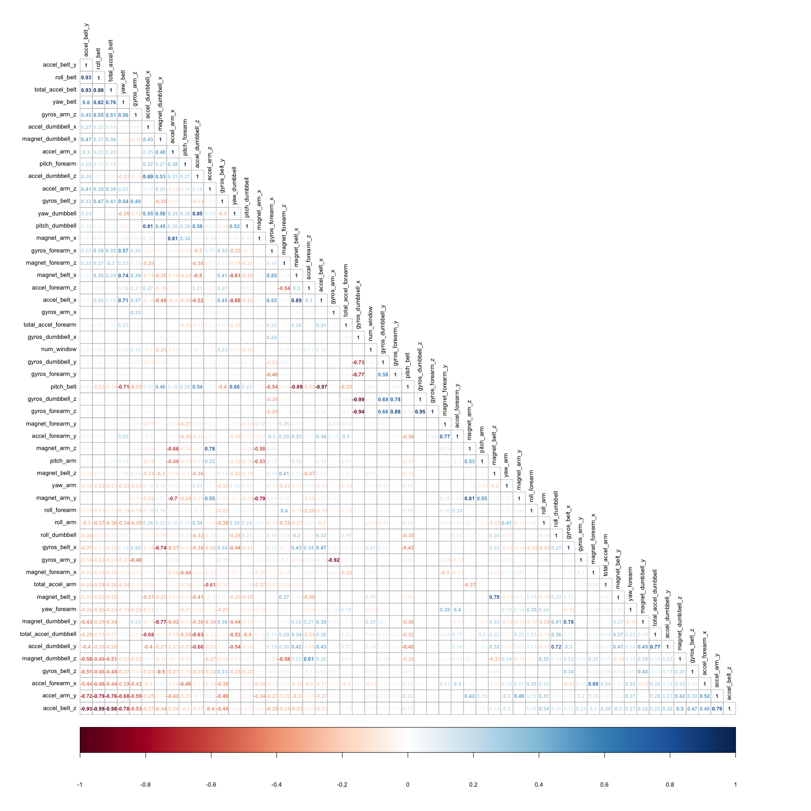
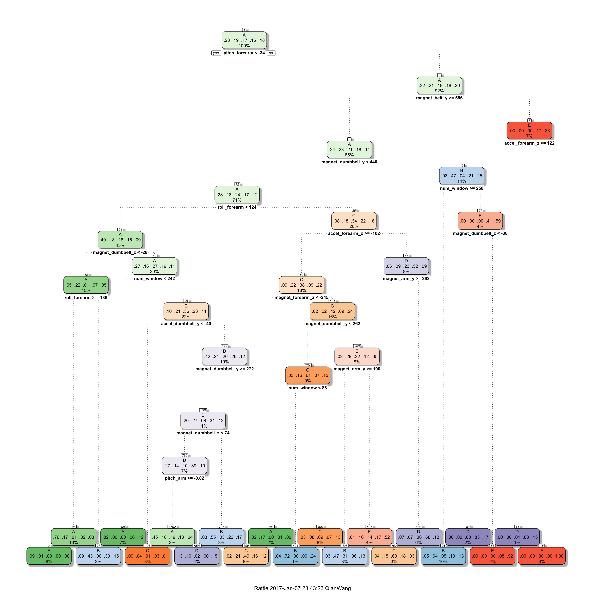
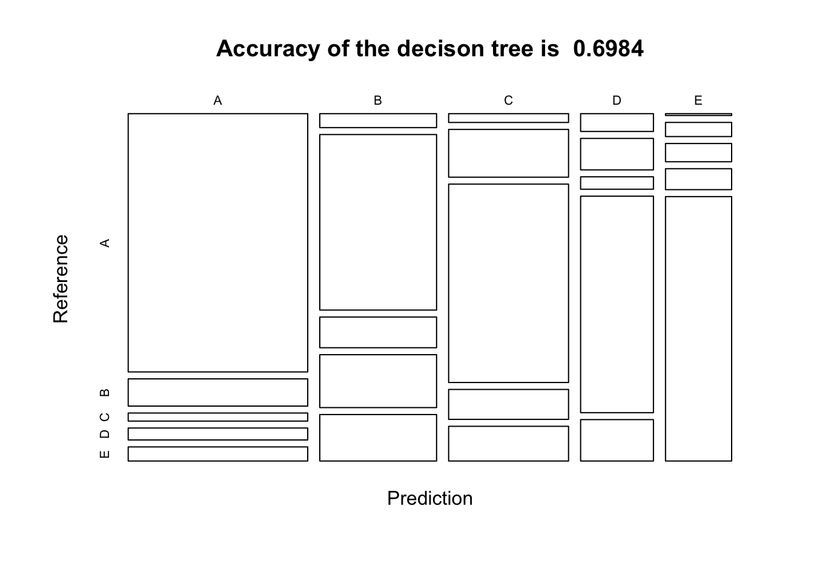
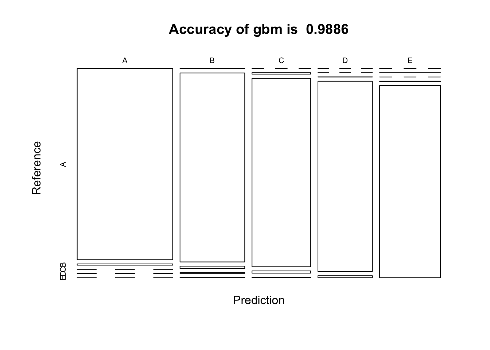
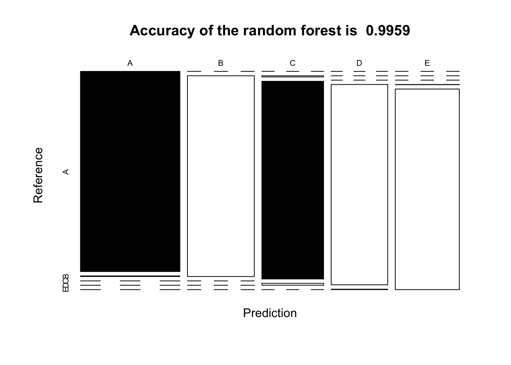

# Project-quantify-the-particular-activities-by-digging-data-from-accelerometers

## Introduction
Using devices such as Jawbone Up, Nike FuelBand, and Fitbit it is now possible to collect a large amount of data about personal activity relatively inexpensively. These type of devices are part of the quantified self movement – a group of enthusiasts who take measurements about themselves regularly to improve their health, to find patterns in their behavior, or because they are tech geeks. One thing that people regularly do is quantify how much of a particular activity they do, but they rarely quantify how well they do it. In this project, the goal will be to use data from accelerometers on the belt, forearm, arm, and dumbell of 6 participants.

* for details please visit : [http://groupware.les.inf.puc-rio.br/har](http://groupware.les.inf.puc-rio.br/har)
* The data set for training: [https://d396qusza40orc.cloudfront.net/predmachlearn/pml-training.csv](https://d396qusza40orc.cloudfront.net/predmachlearn/pml-training.csv)
* The data set for the 20 quiz test:[https://d396qusza40orc.cloudfront.net/predmachlearn/pml-testing.csv](https://d396qusza40orc.cloudfront.net/predmachlearn/pml-testing.csv)

## Specific Aims
Construct models by using three different methods ("Generalized Boosted Models", "Random Forest" and "Decision Tree"). Compare among them and find out which is the best model by testing their accuracy on predicting the test data set.

The goal of your project is to predict the manner in which they did the exercise. This is the "classe" variable in the training set. You may use any of the other variables to predict with. You should create a report describing how you built your model, how you used cross validation, what you think the expected out of sample error is, and why you made the choices you did. You will also use your prediction model to predict 20 different test cases.

The codes and the results are shown in the .md file: [Quantifying_activity_by_accelerometers.md](https://github.com/wangqian2149185/Project-quantify-the-particular-activities-by-digging-data-from-accelerometers/blob/master/Quantifying_activity_by_accelerometers.md)

## Repository components
* README.md
* [Quantifying_activity_by_accelerometers.md](Quantifying_activity_by_accelerometers.md)
* [Quantifying_activity_by_accelerometers.Rmd](Quantifying_activity_by_accelerometers.Rmd)
* CorrelationMatrix_among_var-1.png
* dtr-1.png

* dtr_plot-1.png

* gbm_plot-1.png

* rf_plot-1.png

